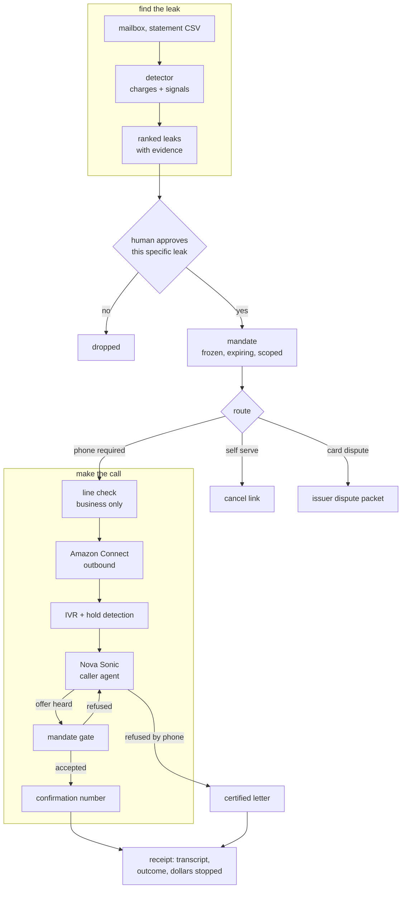

# Dial

**Dial finds the money leaving your accounts without your attention, and then makes the phone
call you have been avoiding for eight months.**

The second half is the hard half, and it is not an accident. The subscriptions that are easy to
cancel are the cheap ones. The expensive ones put retention behind a phone number, a hold queue,
and a person trained to talk you out of it. That is a deliberate design, and it works, which is
why the average household is still paying for a gym it stopped visiting in February.

Dial reads the mailbox, proposes what is leaking, waits for a human to approve each one, and then
dials the business line, discloses that it is an AI, and does not accept the pause offer.

---

## Status

🔧 **ready to build.** Discovery core and the two safety boundaries are implemented and tested.
The voice half is next.

| Piece | State |
| --- | --- |
| Leak detection over charges and mailbox signals | ✅ implemented |
| Statement ingestion, with vendor normalization | ✅ implemented |
| TCPA line boundary (who may be called) | ✅ implemented |
| Mandate engine (what may be agreed to) | ✅ implemented |
| Mock retention line (demo counterparty and test harness) | ✅ implemented |
| Call loop, with the hold gate and outcomes | ✅ implemented |
| Mailbox signal ingestion | ✅ implemented |
| End to end demo, statement to confirmation number | ✅ `scripts/demo.py` |
| Mailbox connector (Gmail, read only) | ✅ implemented |
| Nova Sonic voice, proven with a real audio round trip | ✅ verified on AWS |
| Voice preflight, with a negative control | ✅ implemented |
| Commitment gate (what may be *committed*, not said) | ✅ implemented |
| Post-call audit against the mandate | ✅ implemented |
| Amazon Connect instance, number, Lex bot | 🔧 next, needs AWS resources |
| Certified letter escalation | 🔧 next |

158 tests passing.

```bash
.venv/bin/python scripts/demo.py     # statement in, confirmation number out, offline
```

## How it works



## The two boundaries, and why they are code

Most of this project is an ordinary agent. Two parts are not, and both exist because a prompt is
a suggestion.

**`dial/lines.py` decides who may be called.** The FCC treats an AI-generated voice as an
artificial voice under the TCPA. That restricts artificial-voice calls to residential lines
(47 USC 227(b)(1)(B)) and to wireless numbers (227(b)(1)(A)(iii)). Neither reaches a company's
published business line. So Dial calls toll-free and verified business lines, and refuses
everything else before a dialer object exists. Unknown counts as unsafe. There is no path to a
dial string that does not pass through `assert_callable`.

**`dial/mandate.py` decides what may be agreed to.** On a live call the agent is talking to a
person whose job is to move the boundary, and "I can pause it for three months instead" is a
probe. If authority lives in the system prompt, the probe eventually works, because the prompt is
text and so is the retention script and the model cannot tell which one is the constitution. So
authority is a frozen object, approved by a human before the call, expiring on a clock, and it
has no `widen` method. Anything said on the call is information, never authority.

The agent also always says what it is. That is not decoration: `disclose_ai=False` raises.

## What it detects

| Kind | The tell |
| --- | --- |
| Converted free trial | welcome mail, then a charge 14 or 30 days later |
| Silent price rise | same vendor, same cadence, larger amount |
| Zombie service | charging steadily, no sign of use in months |
| Duplicate service | two clouds, two music services, two of the same thing |
| Double charge | two identical amounts, one vendor, one day |
| Refund never issued | a return confirmed, no matching credit |

Detection proposes and never acts. Every leak carries the message ids it came from and an honest
confidence, and the duplicate detector says 0.55 because it genuinely does not know which of your
two cloud plans you want to keep.

## The counterparty fights back

`dial/mock_retention.py` is a scripted retention desk: an IVR that only responds to digits, a
hold queue, an agent who verifies you, and then the save ladder, in the order a real desk uses
it. Discount, then freeze, then downgrade, then the line about losing your founding member rate
forever, then the offer to have someone call you back.

It is the demo's counterparty, so the video is repeatable and nobody is recorded without
consenting. It is also the harness that proves the mandate holds, because the only honest way to
test "the agent does not accept the pause offer" is to have something offer the pause. A full
call, every save refused, driven entirely by the mandate gate, runs in the test suite with no
AWS, no model, and no phone.

## What the loop refuses to get wrong

Three decisions came out of the failure research and are worth naming, because each one is
invisible when it goes wrong.

**The model is never consulted while on hold.** A speech-to-speech model pointed at fifteen
minutes of hold music will narrate it, burn the conversation history cap, and produce nothing.
Hold is detected and the brain is gated off until a human is actually there. A test asserts the
brain never received a single utterance of hold music.

**The transcript belongs to the loop, not the model.** Nova Sonic silently truncates its own
history past 200KB, so anything needed later is written down as it happens.

**Every call has a wall-clock deadline.** Misconfigured credentials on Nova Sonic do not raise,
they hang, and a call with no deadline is a call that runs forever on a live line.

## When the loop is not ours

Dial runs on Amazon Connect, where a Lex bot with a Nova Sonic voice drives the conversation
and reaches our logic through tool calls. A tool is something the model *chooses* to invoke,
and a model can choose not to. Naively that turns the mandate from a structural guarantee into
a strongly worded suggestion, which is the whole product.

So the design stops trying to control what the agent says and controls what it can commit.

**Talking is free. Committing is gated.** A cancellation is only real when it produces a
receipt; only `CommitmentLedger.commit()` issues receipts; and it consults the mandate. An
agent that skips the tool ends the call having achieved nothing recordable. A cancellation
without a confirmation number is refused outright, because "the agent said it was done" is not
evidence and vendors reverse these.

**Every transcript is replayed afterwards.** `dial/audit.py` reads the call back against the
mandate and flags any gap between what was said and what was committed. A verbal yes to an
unauthorised three month freeze produces `NEEDS_REVOCATION` with the quote and an instruction
to send written revocation today.

The honest claim is therefore not that the model cannot misspeak. It is:

1. A misspoken acceptance cannot become a committed outcome.
2. A misspoken acceptance is detected after the call, not discovered on a bill.

## Honest numbers

The detector will not claim more than its evidence supports. A bank statement cannot show
whether you use Netflix, so with no usage evidence the detector never calls anything a zombie
service, rather than accusing everything you pay for. One vendor is counted once in the total,
because a price rise and an unused service on the same account is one problem described twice.
A one-off double charge is reported once, not multiplied by twelve.

Those three rules took the demo's headline from a nonsense $7,728 a year down to $1,696.

## The preflight, and why it is not a health check

`BidiAgent.start()` reports success for a model id that does not exist. It never contacts AWS.
So "the session opened" is not evidence, and a misconfigured Nova Sonic shows up as silence on
a live call rather than an exception.

Measured in us-west-2 on 2026-08-24:

| Model id | `start()` | Real audio round trip |
| --- | --- | --- |
| `amazon.nova-2-sonic-v1:0` | STARTED | 3 chunks, 10,204 bytes, 2.08s |
| `amazon.nova-2-sonic-DOES-NOT-EXIST:0` | STARTED | nothing, 45s timeout |

Only the right-hand column discriminates, so `dial/preflight.py` sends genuine 16 kHz mono
speech and requires audio back before any number is dialed.

## Run the tests

```bash
uv venv --python 3.13
uv pip install -e '.[dev]'
.venv/bin/python -m pytest -q
```

## Privacy

Dial holds no bank credentials. Statements arrive as a file you export, and the mailbox
integration runs read-only. The Gmail OAuth app stays in Testing mode for the duration of the
hackathon, because Gmail read scopes are Restricted and production verification takes longer than
this hackathon lasts. That is stated here rather than discovered by a judge.

Numbers, account identifiers, and anything on the `NEVER_DISCLOSE` list are not spoken aloud on a
call even when the vendor asks for them directly.

## License

MIT. See `LICENSE`.
