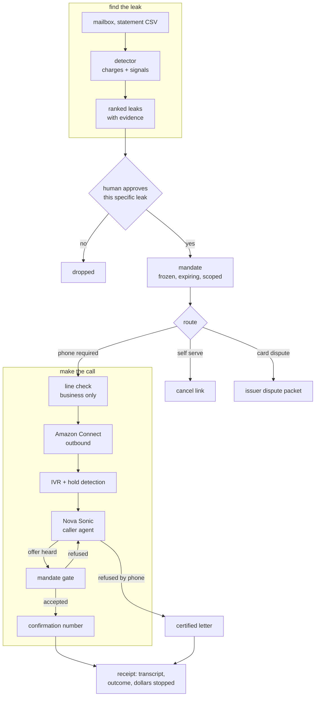

# Dial

**Dial finds the money leaving your accounts without your attention, and then makes the phone
call you have been avoiding for eight months.**

The second half is the hard half, and it is not an accident. The subscriptions that are easy to
cancel are the cheap ones. The expensive ones put retention behind a phone number, a hold queue,
and a person trained to talk you out of it. That is a deliberate design, and it works, which is
why the average household is still paying for a gym it stopped visiting in February.

Dial reads the mailbox, proposes what is leaking, waits for a human to approve each one, and then
dials the business line, discloses that it is an AI, and does not accept the pause offer.

---

## Status

🔧 **ready to build.** Discovery core and the two safety boundaries are implemented and tested.
The voice half is next.

| Piece | State |
| --- | --- |
| Leak detection over charges and mailbox signals | ✅ implemented, 25 tests |
| TCPA line boundary (who may be called) | ✅ implemented, 13 tests |
| Mandate engine (what may be agreed to) | ✅ implemented, 17 tests |
| Nova Sonic caller agent | 🔧 next |
| Amazon Connect telephony | ⛔ blocked on AWS account |
| Certified letter escalation | 🔧 next |

## How it works



## The two boundaries, and why they are code

Most of this project is an ordinary agent. Two parts are not, and both exist because a prompt is
a suggestion.

**`dial/lines.py` decides who may be called.** The FCC treats an AI-generated voice as an
artificial voice under the TCPA. That restricts artificial-voice calls to residential lines
(47 USC 227(b)(1)(B)) and to wireless numbers (227(b)(1)(A)(iii)). Neither reaches a company's
published business line. So Dial calls toll-free and verified business lines, and refuses
everything else before a dialer object exists. Unknown counts as unsafe. There is no path to a
dial string that does not pass through `assert_callable`.

**`dial/mandate.py` decides what may be agreed to.** On a live call the agent is talking to a
person whose job is to move the boundary, and "I can pause it for three months instead" is a
probe. If authority lives in the system prompt, the probe eventually works, because the prompt is
text and so is the retention script and the model cannot tell which one is the constitution. So
authority is a frozen object, approved by a human before the call, expiring on a clock, and it
has no `widen` method. Anything said on the call is information, never authority.

The agent also always says what it is. That is not decoration: `disclose_ai=False` raises.

## What it detects

| Kind | The tell |
| --- | --- |
| Converted free trial | welcome mail, then a charge 14 or 30 days later |
| Silent price rise | same vendor, same cadence, larger amount |
| Zombie service | charging steadily, no sign of use in months |
| Duplicate service | two clouds, two music services, two of the same thing |
| Double charge | two identical amounts, one vendor, one day |
| Refund never issued | a return confirmed, no matching credit |

Detection proposes and never acts. Every leak carries the message ids it came from and an honest
confidence, and the duplicate detector says 0.55 because it genuinely does not know which of your
two cloud plans you want to keep.

## Run the tests

```bash
uv venv --python 3.13
uv pip install -e '.[dev]'
.venv/bin/python -m pytest -q
```

## Privacy

Dial holds no bank credentials. Statements arrive as a file you export, and the mailbox
integration runs read-only. The Gmail OAuth app stays in Testing mode for the duration of the
hackathon, because Gmail read scopes are Restricted and production verification takes longer than
this hackathon lasts. That is stated here rather than discovered by a judge.

Numbers, account identifiers, and anything on the `NEVER_DISCLOSE` list are not spoken aloud on a
call even when the vendor asks for them directly.

## License

MIT. See `LICENSE`.
